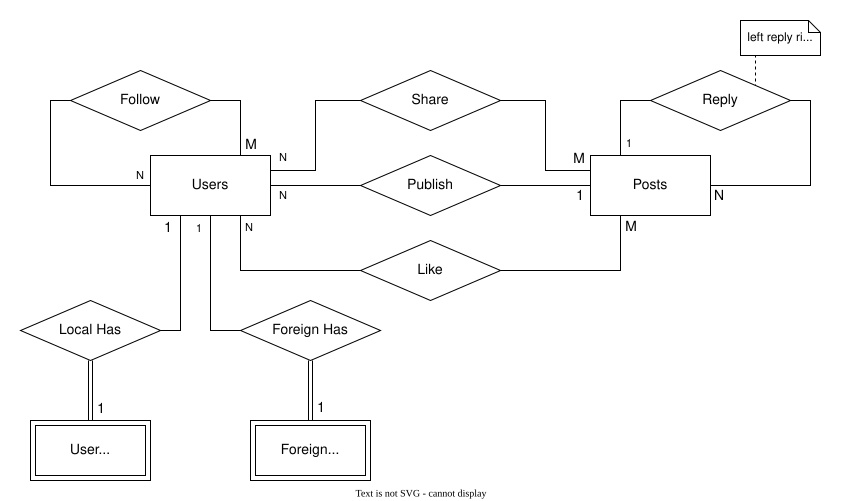

# Main Database

Use PostgreSql. Database: `austrody`



## TYPES

- vsb: visibility of post
- img: image

```sql
CREATE TYPE vsb AS ENUM (
  0, 1, 2
);

CREATE TYPE img AS (
  "type" text,
  "url" text,
  "alt" text
);
```

## TABLE: `users`

- username *PRIMARY*: `text`
- foreign: `boolean` marking whether a foreign user
- id *INDEX*: `text` as foreign user's activitypub id
- nickname: `text`
- summary: `text`
- avatar *NULLABLE*: `img`
- lock: `boolean` indicating whether a locked account
- pub_key: `text` as user's public key (RSA)
- pri_key: `text` as local user's private key (RSA)

CONSTRAINT:

- if `foreign`, `id` must not null; else `pri_key` must not null.

> NOTE: for foreign user, `username` syntax is `username@domain`.

```sql
CREATE TABLE IF NOT EXISTS "users" (
  "username" text,
  "foreign" boolean NOT NULL,
  "id" text NOT NULL UNIQUE,
  "nickname" text NOT NULL,
  "summary" text DEFAULT '',
  "avatar" img,
  "lock" boolean DEFAULT FALSE,
  "pub_key" text NOT NULL,
  "pri_key" text,
  PRIMARY KEY ("username"),
  CONSTRAINT "foreign_user" CHECK (
    ("foreign" = FALSE AND "pri_key" <> NULL) OR "foreign" = TRUE
  )
);

CREATE INDEX "user_id" ON "users"("id");

CREATE VIEW "user_content" AS 
    SELECT "user", "tgt" AS "id", "date", "vsb", "user" AS "shared_by"
    FROM "share"
  UNION
    SELECT "user", "id", "date", "vsb", NULL AS "shared_by"
    FROM "posts"
  ORDER BY "date" DESC;
```

### Query all status of a user

> It's necessary to filter by `vsb`

```sql
WITH "l" AS (
  SELECT
    "tgt" AS "id", "date" AS "act",
    ${user} AS "shared_by", NULL AS "reply_to"
  FROM "share" WHERE "user" = ${user}
UNION
  SELECT
    "posts"."id", "posts"."date" AS "act",
    NULL AS "shared_by", "reply"."tgt_user" AS "reply_to"
  FROM "posts" LEFT JOIN "reply"
    ON "posts"."user" = ${user} AND "reply"."id" = "posts"."id"
)
SELECT * FROM "l"
-- filtered by date
ORDER BY "act" DESC
-- limit size
;
```

## TABLE: `user_preferences`

- username: `text`, referencing `users.username`
- password: `text` as encrypted password
- preferences: `jsonb`

> NOTE: Only local users

```sql
CREATE TABLE IF NOT EXISTS "user_preferences" (
  "username" text,
  "password" text,
  "preferences" jsonb DEFAULT '{"postVsb":"public","shareVsb":"public"}',
  PRIMARY KEY ("username"),
  FOREIGN KEY ("username") REFERENCES "users"("username")
);
```

## TABLE: `foreign_inboxes`

- username: `text`, referencing `users.username`
- inbox: `text` as user inbox url
- shared *NULLABLE*: `text` as instance inbox url

```sql
CREATE TABLE IF NOT EXISTS "foreign_inboxes" (
  "username" text,
  "inbox" text NOT NULL,
  "shared" text,
  PRIMARY KEY ("username"),
  FOREIGN KEY ("username") REFERENCES "users"("username")
);
```

## TABLE: `follow`

- from *PRIMARY, INDEX*: `text`, referencing `users.username`
- to *PRIMARY, INDEX*: `text`, referencing `users.username`

CONSTRAINT:

- `from` != `to`

```sql
CREATE TABLE IF NOT EXISTS "follow" (
  "from" text,
  "to" text CHECK ("to" <> "from"),
  PRIMARY KEY ("from", "to"),
  FOREIGN KEY ("from") REFERENCES "users"("username"),
  FOREIGN KEY ("to") REFERENCES "users"("username")
);

CREATE INDEX "user_follows" ON "follow" ("from");
CREATE INDEX "user_be_followed" ON "follow" ("to");

CREATE VIEW "follow_data" ("user", "followings", "followers") AS
  WITH "followings" AS (
    SELECT "from" AS "u", COUNT(*) AS "c"
    FROM "follow" GROUP BY "u"
  ), "followers" AS (
    SELECT "to" AS "u", COUNT(*) AS "c"
    FROM "follow" GROUP BY "u"
  )
  SELECT
    "users"."username" AS "user",
    COALESCE("followings"."c", 0) AS "followings",
    COALESCE("followers"."c", 0) AS "followers"
  FROM "users"
  FULL JOIN "followings"
    ON "users"."username" = "followings"."u"
  FULL JOIN "followers"
    ON "users"."username" = "followers"."u";
```

## TABLE: `posts`

- id *PRIMARY*: `text` as uuid
- tombstone: `boolean` as whether a removed post
- url: `text` as url
- user *INDEX*: `text`, referencing `user.username`
- date: `timestap`
- vsb: `vsb` as visibility of post
- content: `text`
- media: `img[]` as images attaching to this post

```sql
CREATE TABLE IF NOT EXISTS "posts" (
  "id" varchar(36) NOT NULL,
  "tombstone" boolean DEFAULT FALSE,
  "fid" text NOT NULL UNIQUE,
  "user" text NOT NULL,
  "date" timestamp NOT NULL,
  "vsb" vsb NOT NULL,
  "content" text NOT NULL,
  "media" img[] DEFAULT array[]::img[],
  PRIMARY KEY ("id"),
  FOREIGN KEY ("user") REFERENCES "users"("username")
);

CREATE INDEX "posters" ON "posts" ("user");

CREATE VIEW "post_data" AS
  WITH "r" AS (
    SELECT "tgt", COUNT(*) AS "c"
    FROM "reply" GROUP BY "tgt"
  ),
  "s" AS (
    SELECT "tgt", COUNT(*) AS "c"
    FROM "share" GROUP BY "tgt"
  ),
  "l" AS (
    SELECT "tgt", COUNT(*) AS "c"
    FROM "like" GROUP BY "tgt"
  ), "ps" AS (
    SELECT
      "posts".*,
      COALESCE("r"."c", 0) AS "replies",
      COALESCE("s"."c", 0) AS "shares",
      COALESCE("l"."c", 0) AS "likes"
    FROM "posts"
    FULL JOIN "r" ON "posts"."id" = "r"."tgt"
    FULL JOIN "s" ON "posts"."id" = "s"."tgt"
    FULL JOIN "l" ON "posts"."id" = "l"."tgt"
  )
  SELECT "ps".*, "reply"."tgt" AS "replying", "reply"."tgt_user" AS "reply_to"
  FROM "ps" LEFT JOIN "reply" ON "ps"."id" = "reply"."id";
```

*Note*: `user` syntax is `username` for local users or `username@domain` for foreign users.

## TABLE: `reply`

- id *PRIMARY, FOREIGN*: `text` as uuid of the replying post, referencing to `posts.id`
- reply *PRIMARY, FOREIGN, INDEX*: `text` as uuid of the post replied, referencing to `posts.id`

```sql
CREATE TABLE IF NOT EXISTS "reply" (
  "id" varchar(36) UNIQUE,
  "tgt" varchar(36),
  "tgt_user" text,
  PRIMARY KEY ("id", "tgt"),
  FOREIGN KEY ("id") REFERENCES "posts"("id"),
  FOREIGN KEY ("tgt") REFERENCES "posts"("id"),
  FOREIGN KEY ("tgt_user") REFERENCES "users"("username")
);

CREATE INDEX "post_replies" ON "reply"("tgt");
```

### Query

```sql
-- replying
WITH RECURSIVE "rs" AS (
    SELECT "id", "tgt" FROM "reply" WHERE "id" = ${postID}
  UNION ALL
    SELECT "reply"."id", "reply"."tgt" FROM "reply"
    JOIN "rs" ON "rs"."tgt" = "reply"."id"
)
SELECT "id", "tgt" FROM "rs";

-- replies
WITH RECURSIVE "rs" AS (
    SELECT "id", "tgt" FROM "reply" WHERE "tgt" = ${postID}
  UNION ALL
    SELECT "reply"."id", "reply"."tgt" FROM "reply"
    JOIN "rs" ON "rs"."id" = "reply"."tgt"
)
SELECT "id", "tgt" FROM "rs";
```

## TABLE: `like`

- user *PRIMARY*: `text`, referencing `user.username`
- id *PRIMARY, FOREIGN, INDEX*: `text` as uuid, referencing to `posts.id`

```sql
CREATE TABLE IF NOT EXISTS "like" (
  "user" text,
  "tgt" varchar(36),
  PRIMARY KEY ("user", "tgt"),
  FOREIGN KEY ("user") REFERENCES "users"("username"),
  FOREIGN KEY ("tgt") REFERENCES "posts"("id")
);

CREATE INDEX "post_likes" ON "like"("tgt");
```

## TABLE: `share`

- user *PRIMARY, INDEX*: `text` as username
- id *PRIMARY, FOREIGN, INDEX*: `text` as uuid, referencing to `posts."id"`
- date: `timestamp`
- vsb: `vsb` as visibility of sharing

```sql
CREATE TABLE IF NOT EXISTS "share" (
  "user" text NOT NULL,
  "tgt" varchar(36) NOT NULL,
  "date" timestamp NOT NULL,
  "vsb" vsb NOT NULL,
  PRIMARY KEY ("user", "tgt"),
  FOREIGN KEY ("user") REFERENCES "users"("username"),
  FOREIGN KEY ("tgt") REFERENCES "posts"("id")
);

CREATE INDEX "post_shares" ON "share"("tgt");
CREATE INDEX "sharer" ON "share"("user");
```

*Note*: `user` syntax is `username` for local users or `username@domain` for foreign users.